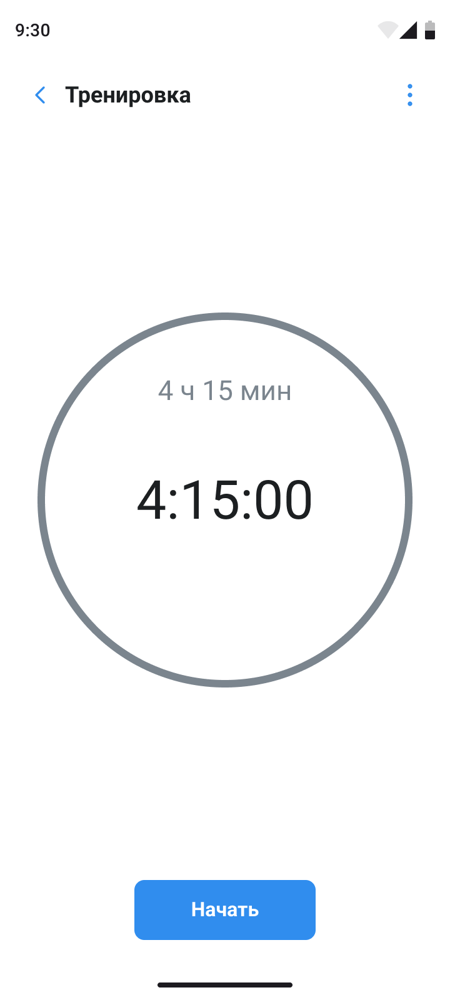
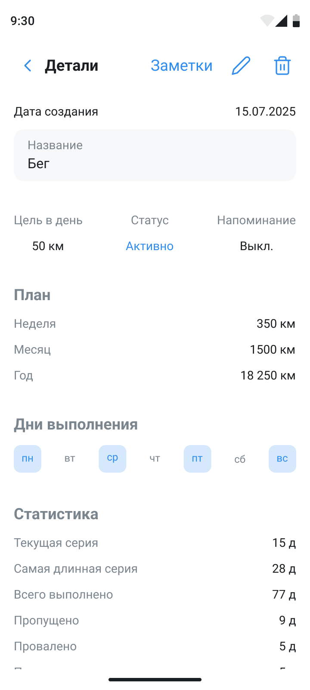
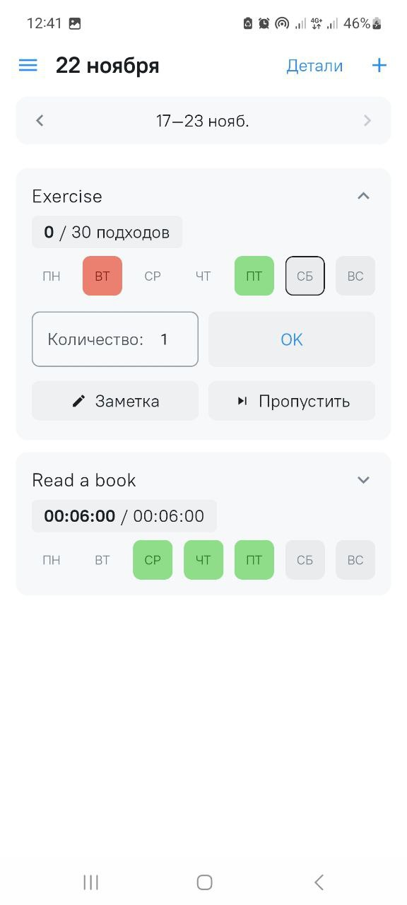

# Juyem - Hsbit tracker app

**Status:** 🚧 In Active Development

A modern Android habit tracking application built with Clean Architecture and Jetpack Compose.

## About

Juyem is a habit tracking application that helps you build and monitor your habits, track your progress, and achieve your goals. The project is being developed using modern Android development stack and best architecture practices.

## Screenshots

<div align="center">
  
  
  
</div>

## Tech Stack

- **Language:** Kotlin
- **UI:** Jetpack Compose + Material 3
- **Architecture:** Multi-module Clean Architecture
- **DI:** Hilt
- **Database:** Room
- **Async:** Coroutines + Flow
- **Navigation:** Navigation Compose
- **Build:** Gradle (KTS)

## Current Features

### ✅ Habit Tracking (Implemented)

- **Habit list view** with weekly navigation
- **Three habit types:**
  - Boolean (yes/no)
  - Counter (with goal value and units)
  - Timer (time tracking)
- **Progress tracking** by days of week
- **CRUD operations** for habits

## Planned Features

- 🚧 Habit detail screen
- 📋 Create and edit habit screens
- 📋 Settings screen
- 📋 Notes for habits
- 📋 Extended statistics and analytics
- 📋 Timer sessions for habits

## Requirements

- Android Studio Hedgehog | 2023.1.1 or newer
- JDK 17
- Android SDK 26+ (minimum version)
- Android SDK 36 (target version)

## Installation & Running

1. Clone the repository:
```bash
git clone <repository-url>
cd Juyem
```

2. Open the project in Android Studio

3. Sync Gradle:
```bash
./gradlew build
```

4. Run the app on an emulator or device

## Contact

Developer: [@nkaiyrken](https://github.com/nkaiyrken)

---

**Note:** This project is in early development stage. Features and documentation will be updated as the project evolves.
